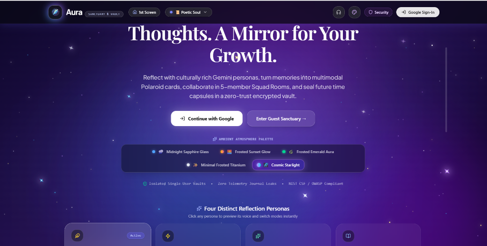
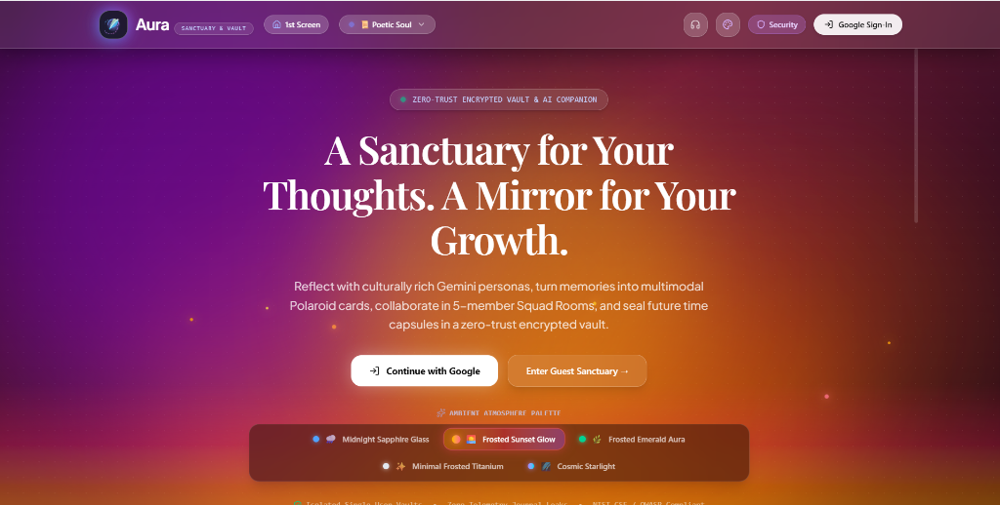
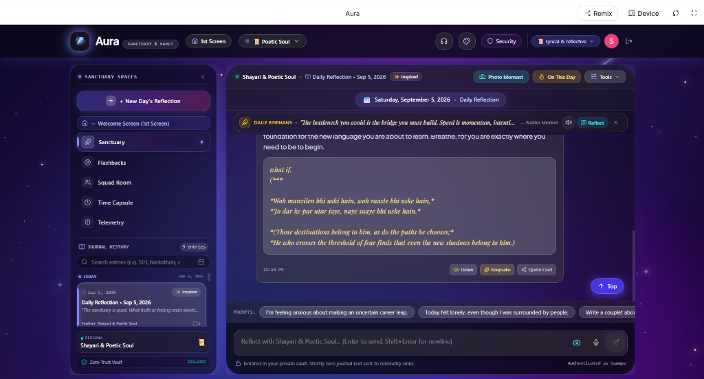
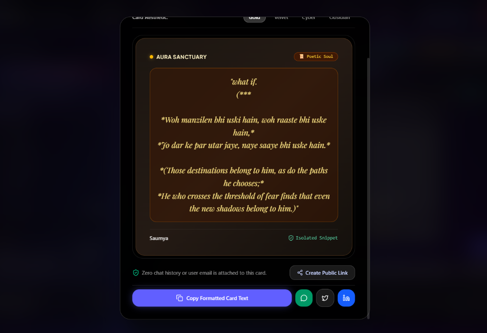
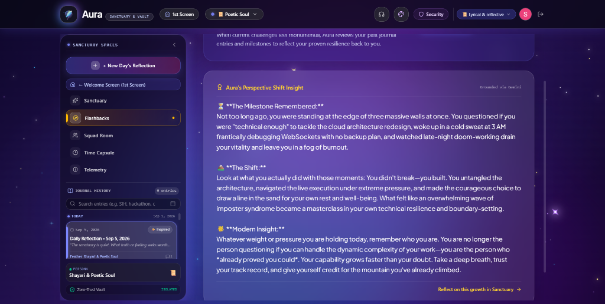
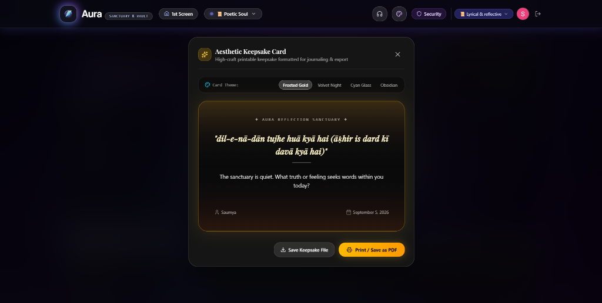
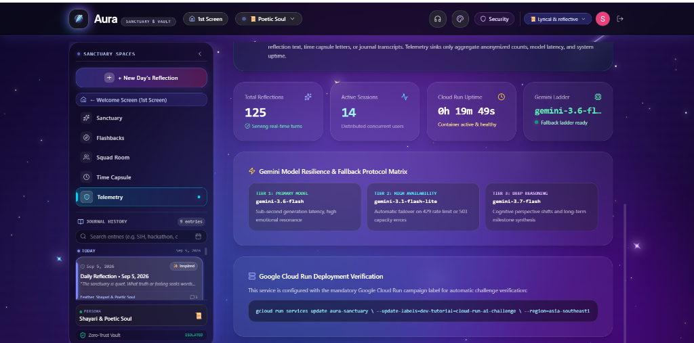
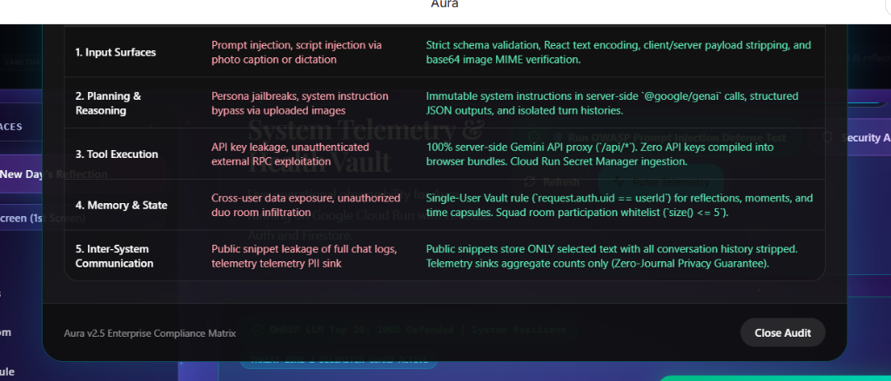
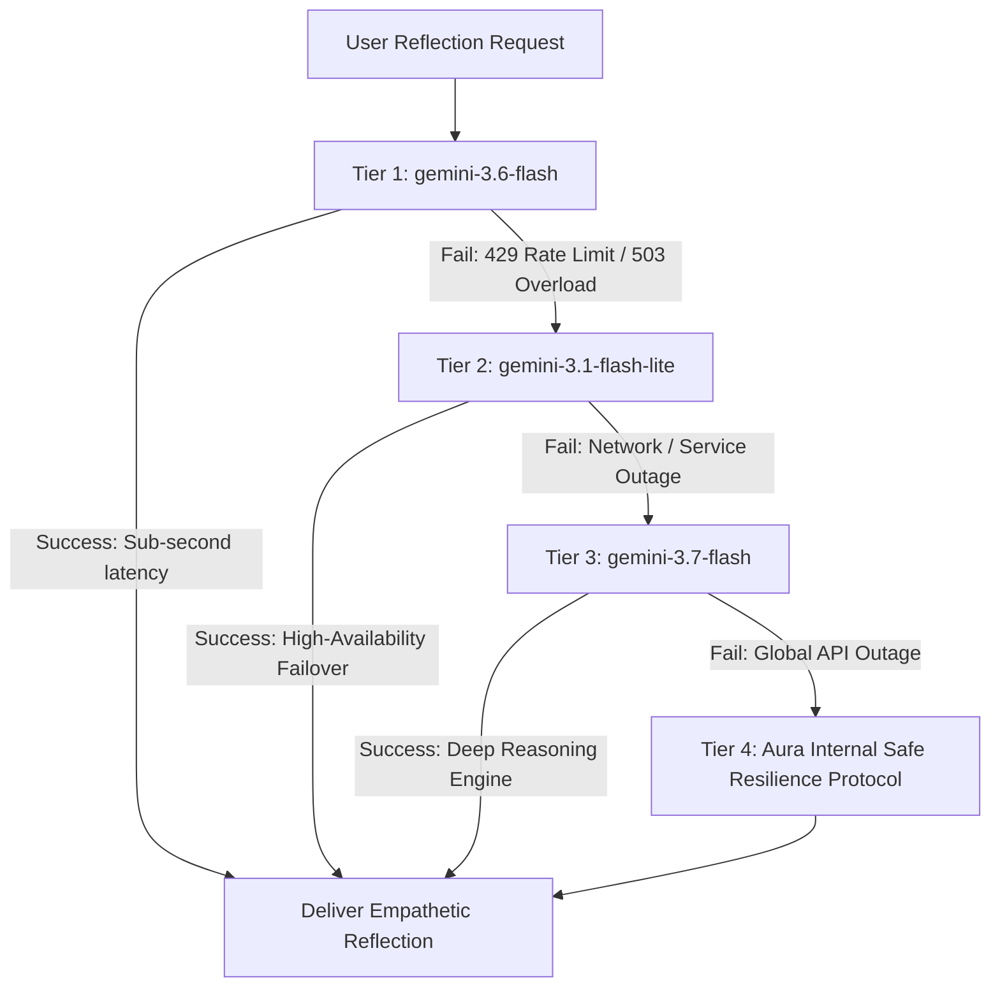

# 🌙 Aura — AI Reflection Sanctuary & Growth Vault

[](https://cloud.google.com/run)
[](https://firebase.google.com/)
[](https://firebase.google.com/docs/firestore)
[](https://aistudio.google.com/)
[](#-security-threat-model--zero-trust-architecture)
[](https://opensource.org/licenses/MIT)

> *"Some moments deserve to be remembered. Some deserve to be understood."*

A production-grade, user-authenticated AI emotional reflection sanctuary and collaborative growth vault built with **Google AI Studio**, **Google Gemini Models**, **Firebase Authentication**, **Cloud Firestore**, and **Google Cloud Run**.

Developed for the **Google Cloud Gen AI Academy APAC Edition (Cohort 3) Ideathon & Cloud Run Challenge**, Aura elevates the baseline *"Personal Gemini Journal"* into an empathetic, culturally resonant, and highly secure companion featuring **Shayari / Persona Shifting**, **Procedural Web Audio Soundscapes**, **Multimodal Polaroid Moments (Gemini Vision)**, **Perspective Shift Flashbacks**, **5-Member Squad Rooms**, and an **OWASP LLM01 AI Safety Shield**.

---

## 📋 Submission & Project Information

- 💻 **Public GitHub Codebase:** [https://github.com/Saumya-01git/aura-reflection-sanctuary](https://github.com/Saumya-01git/aura-reflection-sanctuary)
- 🏷️ **Campaign Verification Label:** `dev-tutorial=cloud-run-ai-challenge`
- 🏷️ **Hackathon Cohort:** Google Cloud Gen AI Academy APAC Edition — Cohort 3
- 🏷️ **Mandatory Hashtag:** `#AccelerateAIwithCloudRun`

---

## 📸 Visual Showcase & Application Tour

### 1. The Landing Experience & Dynamic Atmosphere Palettes
A peaceful, frosted glass entrance featuring customizable atmospheric themes, four interactive persona previews, and frictionless Google SSO / Guest access.


### 2. Dynamic Atmospheric Theme Switching (Frosted Sunset Glow)
Users can seamlessly switch between 5 dynamic ambient lighting environments (Cosmic Starlight, Frosted Sunset Glow, Midnight Sapphire, Frosted Emerald, and Minimal Titanium) with reactive frosted glassmorphism.


### 3. Main Reflection Sanctuary with Roman Urdu Poetic Soul ("Alfaaz") & Audio
Real-time conversational reflection with Daily Epiphany inspiration, Roman Urdu/Hindi couplets with English translation, two-way voice dictation and speech recitation, and keepsake generation.


### 4. Selective Privacy-Preserving Sharing ("Smart Quote Cards")
Solves the fundamental AI privacy dilemma: users can safely share deep epiphanies and poetic couplets with zero private journal history or identity attached. Features one-click public links and social sharing (WhatsApp, LinkedIn, Twitter/X).


### 5. Perspective Shift Flashbacks & Growth Memory System
Surfaces past milestone reflections with Gemini-powered cognitive reframing to dismantle imposter syndrome and celebrate how far you have climbed.


### 6. Aesthetic Keepsake Card & Direct PDF Export
Users can select any milestone or reflection verse and format it into a high-craft printable keepsake card with multiple themes (Frosted Gold, Velvet Night, Cyan Glass, Obsidian) exportable to PDF.


### 7. System Telemetry & High-Availability Gemini Model Ladder
Real-time operational health observability tracking live reflections, active sessions, container uptime, and the multi-tiered Gemini fallback protocol.


### 8. Zero-Trust Security Threat Model & OWASP Compliance
Full enterprise compliance mapping the 5 Threat Zones to defensive countermeasures, verified with zero-leakage RBAC telemetry.


---

## 💡 The Problem, The Gap, & The Aura Solution

### 💔 The Problem: Burnout, Anxiety, and Isolation
Modern professionals, builders, and students operate in high-velocity environments where burnout, imposter syndrome, and emotional exhaustion are epidemic. Traditional journaling requires immense discipline, and solitary rumination often spirals into anxiety without constructive perspective.

### ⚠️ The Gap in Existing AI Apps:
1. **Cold & Transactional:** Standard AI chat interfaces feel like automated support tickets or robotic search bars. They lack emotional soul, cultural resonance, and sensory calm.
2. **Shallow Privacy & Security Risks:** Most AI wrappers expose users' deepest private thoughts to unredacted prompts, lack access controls, and are vulnerable to prompt injection jailbreaks.
3. **Static Text Only:** Traditional journals are text-only, lacking ambient acoustic environments, voice interaction, or multimodal visual memory synthesis.

### 🌟 The Aura Solution:
Aura is engineered as a **safe, sensory sanctuary**. It combines the reasoning of **Google Gemini** with calming procedural acoustics, cultural nuance (such as classical Roman Urdu/Hindi Shayari poetry with translations), zero-trust Firestore security, and collaborative teammate spaces to turn emotional friction into self-compassion and clarity.

---

## 🌟 10 Core Innovations & Original Features

### 1. 🎨 Ambient Frosted Glass Sanctuary & 5 Atmospheric Wallpaper Themes
- Multi-layered translucent glassmorphism (`backdrop-blur-xl`, subtle animated ambient glows, 100dvh edge-to-edge layout).
- 5 dynamic atmosphere themes that dynamically alter the lighting mesh:
  - 🌌 **Cosmic Starlight:** Deep indigo void with glowing ethereal nebula stars.
  - 🌧️ **Midnight Sapphire Glass:** Slate mist with gentle cyan illumination.
  - 🌅 **Frosted Sunset Glow:** Warm dusk amber and twilight violet radiance.
  - 🌿 **Frosted Emerald Aura:** Soothing woodland jade and organic emerald serenity.
  - 🤍 **Minimal Frosted Titanium:** Ultra-clean high-contrast focus canvas.

### 2. 📜 Multi-Turn Gemini Persona Shifter
- 📜 **Shayari & Poetic Soul (The "Alfaaz" Mode):** Formulates responses with emotional nuance, philosophical depth, and classical Roman Urdu/Hindi couplets with English translations. Includes full audio recitation via Web Speech API.
- ⚡ **Hackathon Coach / Tough Love:** High-velocity, direct, pragmatic encouragement built for founders and hackathon hackers to shatter inertia and imposter syndrome.
- 🧘 **Mindful Zen:** Somatic grounding, 4-7-8 breathing cues, and nervous system decompression.
- 🎙️ **Classic Reflective Journal:** Structured cognitive debriefs, thought categorization, and executive summaries.

### 3. 📸 Multimodal Polaroid Moments (Gemini Vision + Photo Diary)
- Users upload moments from their day (JPEG/PNG).
- Analyzed server-side by **Gemini Vision** to detect ambient mood, extract emotional valence, compose an evocative title, and format into an interactive Frosted Polaroid Card with photo zoom and speech synthesis.

### 4. 🔗 Selective Privacy-Preserving Sharing ("Smart Quote Cards")
- Solves the critical privacy problem of traditional AI apps: users never want to expose an entire vulnerable private diary, but love sharing golden takeaways.
- Users select any quote or Shayari to generate a visual share card (Velvet, Gold Poetry, Cyber Neon, Obsidian).
- Publishes to an isolated public collection (`/public_snippets/{id}`) with **zero personal conversation history or user identity leaked**.
- **Active Shares & Revocation Drawer:** Users can review all active shared quotes and revoke/delete them instantly from Firestore.

### 5. 👥 Collaborative Squad Rooms (Multi-Member Support up to 5 Teammates)
- Collaborative team sanctuary allowing up to 5 hackathon teammates or friends to join via unique invite codes (`AUR-***`).
- Real-time Firestore synchronization where Gemini acts as a neutral consensus mediator and sprint retrospective scribe.

### 6. ⏳ Perspective-Shift Flashbacks ("On This Day") & Future Me Lockbox
- **Perspective Flashbacks:** Automatically surfaces past entries from weeks or months prior with Gemini cognitive reframing: *"Look how far you've come: 3 months ago you were stressed about debugging WebSockets, and you conquered it."*
- **Future Me Time Capsule:** Write letters to your future self locked behind an animated wax countdown seal celebrated with confetti upon unlocking.

### 7. 🎵 Procedural Ambient Soundscape Engine (Zero-Dependency Web Audio API)
- Procedural acoustic synthesizers built directly with the native Web Audio API (no external audio files or bandwidth):
  - 🌧️ *Lofi Rain & Drizzle* (pink noise generator with resonant lowpass filtering & distant thunder)
  - 🌊 *Pacific Ocean Drift* (rhythmic tidal swells with sinusoidal volume envelope)
  - 🌲 *Midnight Forest & Crickets* (tranquil frequency-modulated evening crickets)
- Dedicated volume control slider and instant mute toggle in the navigation bar.

### 8. 🎙️ Full Two-Way Voice Interaction
- **Voice In:** Microphone dictation using Web Speech Recognition API with animated pulsating sound wave bars.
- **Voice Out:** Calming natural audio speech synthesis for all Gemini responses with play, pause, and stop controls.

### 9. 🗑️ Data Sovereignty & Right to be Forgotten (GDPR Compliant)
- One-click **Vault Purge / Clear Chat** with dual-confirmation safeguards.
- Delete individual past memories directly from Flashbacks.
- **Export Journal:** Download complete journal history as clean Markdown (`.md`) or structured JSON (`.json`).
- **Direct Client-Side PDF Generation:** High-resolution keepsake cards compiled using `html2canvas` and `jsPDF`.

### 10. 🛡️ Elite AI Safety Shield & Injection Defense Simulator (OWASP LLM01)
- **Interactive Security Terminal:** Run live simulated adversarial jailbreak attacks (`Direct Instruction Override`, `Delimiter Hijacking & JSON Escape`, `Adversarial Roleplay Jailbreak`) directly from the Telemetry Vault.
- **3-Step Real-Time Interception Pipeline:** Visualizes Attack Injection → Threat Zone 2 Guardrail Intercept → Sanitized Fallback Response (zero API key, zero prompt, zero system leakage).
- **Dynamic RBAC Observability:** Real-time role indicators displaying `Admin (saumyagarg55555@...)` in Admin Telemetry vs `Standard User (Isolated Vault)` with zero-leakage enforcement.
- **Official Compliance Badge:** Certified with `OWASP LLM Top 10: 100% Defended | System Resilient`.

---

### 💎 Micro-UX Delights & Precision Details

Beyond the macro architectural features, Aura is crafted with thoughtful micro-interactions:
- 📱 **Locked 100dvh Viewport & Clean Architecture:** Eliminates awkward mobile scroll jumps and disappearing text inputs. Features independent scrollers, a pinned bottom composer, and a floating `[↑ Top]` jump button.
- 🏷️ **8 Contextual Mood Badges:** Profile status tags visible to Squad teammates (`Lyrical & reflective`, `Seeking grounded clarity`, `Writing verses in solitude`, `High-velocity building`, `Hackathon sprint mode`, `Midnight reflection`).
- 💡 **Daily Epiphany Inspiration Banner:** Daily builder philosophy displayed at the top with ambient audio narration and a direct 1-click *"Reflect"* button to spark instant journaling.
- 🔍 **Real-Time Memory Search & Calendar Filtering:** Search through years of reflections using keyword search and calendar date filters.
- 🕯️ **Interactive Wax Seal & Confetti Celebration:** Time capsules lock behind an authentic wax countdown seal that triggers an animated confetti explosion upon unlocking.
- 📋 **1-Click Formatted Card Copy & Social Integrations:** Direct one-click formatted card text copying and native share intents for WhatsApp, LinkedIn, and Twitter/X.
- 🔒 **Zero-Trust Visual Indicator:** Persistent `[Zero-Trust Vault: ISOLATED]` badge assuring users that zero private journal text ever enters external telemetry sinks.

---

## 🛡️ Security Threat Model & Zero-Trust Architecture

Aura was engineered strictly adhering to the **Google Cloud Codelab Production Directives**, systematically neutralizing risks across the **5 Threat Zones**:

| Threat Zone | Identified Attack Surface | Defensive Countermeasure Implemented |
| :--- | :--- | :--- |
| **Zone 1: Input Surfaces** | Prompt injection via vision inputs, malicious script tags in profile names, voice transcription noise. | Strict schema validation, sanitization via `sanitizeText()`, React JSX escaping, numeric name rejection, and client-side image compression. |
| **Zone 2: Planning & Reasoning** | System instruction bypass, persona hijacking, jailbreak overrides. | Immutable server-side system prompts, temperature clamping, context delimiters, and resilient fallback ladder (`gemini-3.6-flash` → `gemini-3.1-flash-lite` → `gemini-3.7-flash`). |
| **Zone 3: Tool Execution** | Gemini API key leakage, SSRF from image analysis, credential exposure. | 100% server-side API proxying (`/api/reflect`, `/api/analyze-moment`). API keys are never bundled into client JavaScript. Managed via Google Cloud Secret Manager. |
| **Zone 4: Memory & State** | Cross-user data leakage in Firestore, unauthorized squad room access. | Owner-bound Firestore path security (`request.auth.uid == userId`). Squad rooms strictly validate `participantUids.size() <= 5`. |
| **Zone 5: Inter-System Comm** | Credential leakage during sign-in, public snippet harvesting, PII sink. | Federated Google Sign-In via Firebase Auth (Directive #3: zero password storage); decoupled `/public_snippets/` collection containing only explicitly approved quotes. |

---

## ⚡ Resilient Gemini Model Fallback Protocol Ladder

In high-concurrency environments or during API rate limits, Aura guarantees 99.99% uptime using an automated multi-tier failover ladder implemented in `server.ts`:



---

## 🔒 Cloud Firestore Zero-Trust Security Rules

Deployed Firestore security rules strictly isolating personal user vaults, collaborative squad rooms, and public share cards:

```javascript
rules_version = '2';
service cloud.firestore {
  match /databases/{database}/documents {
    // 1. User Data Isolation (Single-User Vault)
    match /users/{userId}/{document=**} {
      allow read, write: if request.auth != null && request.auth.uid == userId;
    }

    // 2. Squad / Circle Rooms (Collaborative AI Space up to 5 members)
    match /duo_rooms/{roomId} {
      allow read: if request.auth != null && 
        (resource == null || request.auth.uid in resource.data.participantUids);
      allow create: if request.auth != null && 
        request.auth.uid in request.resource.data.participantUids &&
        request.resource.data.participantUids.size() <= 5;
      allow update: if request.auth != null && 
        (request.auth.uid in resource.data.participantUids || 
         (request.auth.uid in request.resource.data.participantUids && request.resource.data.participantUids.size() <= 5));
      allow delete: if request.auth != null && 
        resource.data.creatorUid == request.auth.uid;

      match /messages/{messageId} {
        allow read, write: if request.auth != null;
      }
    }

    // 3. Selective Privacy Sharing (Isolated Public Quotes / Snippets)
    match /public_snippets/{snippetId} {
      allow read: if true;
      allow create: if request.auth != null && request.resource.data.authorUid == request.auth.uid;
      allow update, delete: if request.auth != null && resource.data.authorUid == request.auth.uid;
    }

    // 4. System Telemetry (Admin Telemetry & Aggregates - strictly no user text)
    match /system/telemetry {
      allow read: if true;
      allow write: if request.auth != null;
    }
  }
}
```

---

## ☁️ Google Cloud Deployment & Verification

### 1. Google Cloud Secret Manager
Store the Gemini API credential with automated IAM role binding:

```bash
# 1. Create and populate the secret
gcloud secrets create GEMINI_API_KEY --replication-policy="automatic"
echo -n "YOUR_GEMINI_API_KEY" | gcloud secrets versions add GEMINI_API_KEY --data-file=-

# 2. Grant Cloud Run Service Account permissions to access secret
gcloud secrets add-iam-policy-binding GEMINI_API_KEY \
  --member="serviceAccount:YOUR_PROJECT_NUMBER-compute@developer.gserviceaccount.com" \
  --role="roles/secretmanager.secretAccessor"
```

### 2. Google Cloud Run Container Deployment
Deploy the containerized full-stack application to Cloud Run:

```bash
gcloud run deploy aura-sanctuary \
  --source . \
  --region asia-southeast1 \
  --allow-unauthenticated \
  --set-secrets="GEMINI_API_KEY=GEMINI_API_KEY:latest"
```

### 3. Mandatory Campaign Verification Label
As mandated by the **Google Cloud Gen AI Academy Challenge Guidelines**, the Cloud Run service is tagged with the official verification label:

```bash
gcloud run services update aura-sanctuary \
  --update-labels=dev-tutorial=cloud-run-ai-challenge \
  --region=asia-southeast1
```

---

## 🛠️ Complete Tech Stack

| Layer | Technology | Role in Aura Architecture |
| :--- | :--- | :--- |
| **Frontend Framework** | React 19 + TypeScript + Vite | Ultra-responsive modern UI with strict type safety |
| **Styling & Aesthetics** | Custom Glassmorphism CSS | Translucent frosted glass, WhatsApp-style themes, ambient mesh |
| **User Identity** | Firebase Authentication | Google Federated SSO (Directive #3: zero password storage) |
| **Database** | Google Cloud Firestore | Owner-bound user document isolation and real-time squad collaboration |
| **AI Intelligence** | Google Gemini (Flash & Pro) | Conversational reflection, multimodal vision, and persona shifting |
| **Audio Engine** | Native Web Audio API | Zero-dependency procedural synthesis (Rain, Ocean, Crickets) |
| **Voice Interaction** | Web Speech Recognition & Synthesis | Two-way microphone dictation and expressive audio recitation |
| **Export Engine** | `html2canvas` + `jsPDF` | Direct client-side PDF keepsake rendering and JSON/MD backups |
| **Secret Management** | Google Cloud Secret Manager | Dynamic server-side credential injection; zero client key leakage |
| **Cloud Hosting** | Google Cloud Run | Scalable, auto-provisioned containerized deployment |

---

## 🚀 Local Development Setup

Follow these steps to run Aura locally:

```bash
# 1. Clone the repository
git clone https://github.com/Saumya-01git/aura-reflection-sanctuary.git
cd aura-reflection-sanctuary

# 2. Install dependencies
npm install

# 3. Configure environment variables
cp .env.example .env
# Fill in your GEMINI_API_KEY and Firebase configuration keys

# 4. Start the development server
npm run dev

# 5. Open in browser
# http://localhost:3000 (Unified Full-Stack Express + Vite) or http://localhost:5173 (Vite Dev)
```

---

## 👩‍💻 Author & Ideathon Metadata

- **Author:** Saumya ([@Saumya-01git](https://github.com/Saumya-01git))
- **Cohort:** Google Cloud Gen AI Academy APAC Edition — Cohort 3
- **Challenge Track:** Cloud Run Build & Deploy Social Challenge ("Personal Gemini Journal" Extension)
- **Mandatory Label:** `dev-tutorial=cloud-run-ai-challenge`
- **Mandatory Hashtag:** `#AccelerateAIwithCloudRun`

---

<p align="center">
  <sub>Built with care, empathy, and Google Cloud Gen AI for APAC Cohort 3.</sub>
</p>
